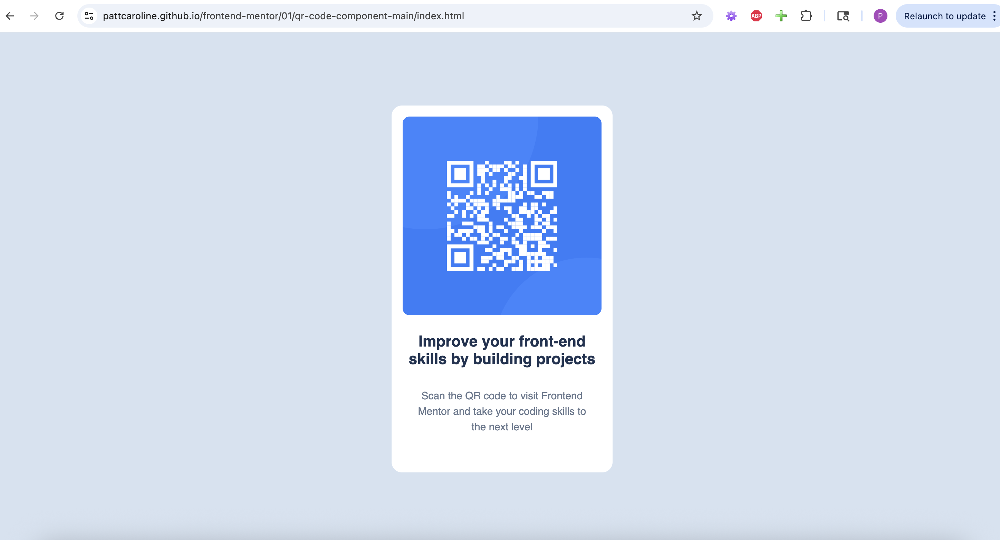

# Frontend Mentor - QR code component solution

This is a solution to the [QR code component challenge on Frontend Mentor](https://www.frontendmentor.io/challenges/qr-code-component-iux_sIO_H). Frontend Mentor challenges help you improve your coding skills by building realistic projects.

## Table of contents

- [Screenshot](#screenshot)
- [Links](#links)
- [Built with](#built-with)
- [Author](#author)

### Screenshot

### Links

- [Solution](https://github.com/pattcaroline/frontend-mentor/tree/main/01/qr-code-component-main/index.html)
- [Live Site](https://pattcaroline.github.io/frontend-mentor/01/qr-code-component-main/index.html)

### Built with

- Semantic HTML5 markup
- CSS custom properties
- Flexbox

## Author

- Frontend Mentor - [@pattcaroline](https://www.frontendmentor.io/profile/pattcaroline)
- Twitter - [@pattcaroline22](https://x.com/pattcaroline22)
