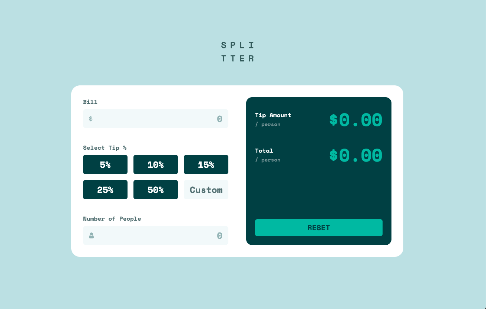

# Frontend Mentor - Tip calculator app solution

This is a solution to the [Tip calculator app challenge on Frontend Mentor](https://www.frontendmentor.io/challenges/tip-calculator-app-ugJNGbJUX). Frontend Mentor challenges help you improve your coding skills by building realistic projects.

## Table of contents

- [Overview](#overview)
  - [The challenge](#the-challenge)
  - [Screenshot](#screenshot)
  - [Links](#links)
- [My process](#my-process)
  - [Built with](#built-with)
  - [What I learned](#what-i-learned)
  - [Useful resources](#useful-resources)
  - [AI Collaboration](#ai-collaboration)
- [Author](#author)

## Overview

### The challenge

Users should be able to:

- View the optimal layout for the app depending on their device's screen size
- See hover states for all interactive elements on the page
- Calculate the correct tip and total cost of the bill per person

### Screenshot

### Links

- Solution URL: [My solution URL here](https://github.com/pattcaroline/frontend-mentor/tree/main/14)
- Live Site URL: [My live site URL here](https://pattcaroline.github.io/frontend-mentor/14/dist/index.html)

## My process

### Built with

- Semantic HTML5 markup
- CSS custom properties
- Flexbox
- CSS Grid
- Mobile-first workflow
- Tailwind CSS

### What I learned

I learned how to use Tailwind CSS for the first time. It was challenging at first but the documentation available at tailwind website make the process a lot smoother.

### Useful resources

- [Tailwindcss](https://tailwindcss.com/) - This website helped me throughout this project.

### AI Collaboration

I used Gemini to help me install tailwind and Vite. Also, I used Gemini to help me build and deploy the final project.

## Author

- Frontend Mentor - [@pattcaroline](https://www.frontendmentor.io/profile/pattcaroline)
- Twitter - [@pattcaroline22](https://x.com/pattcaroline22)
