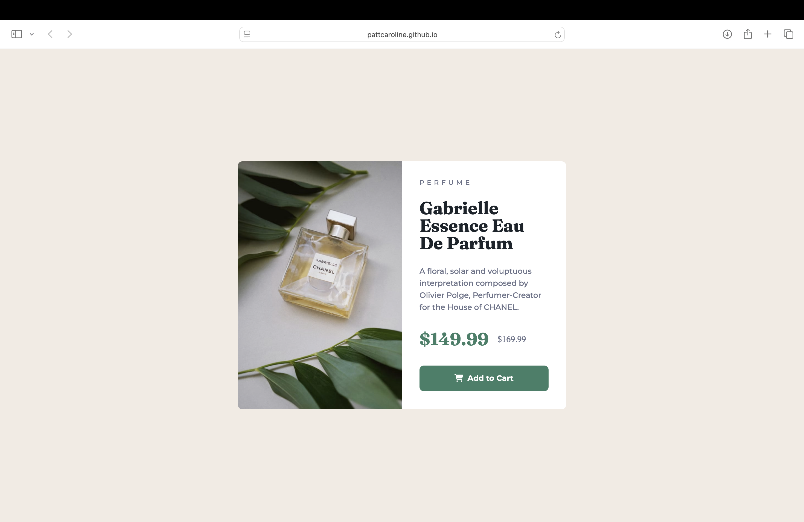

# Frontend Mentor - Product preview card component solution

This is a solution to the [Product preview card component challenge on Frontend Mentor](https://www.frontendmentor.io/challenges/product-preview-card-component-GO7UmttRfa). Frontend Mentor challenges help you improve your coding skills by building realistic projects.

## Table of contents

- [Overview](#overview)
  - [The challenge](#the-challenge)
  - [Screenshot](#screenshot)
  - [Links](#links)
- [My process](#my-process)
  - [Built with](#built-with)
  - [What I learned](#what-i-learned)
  - [Continued development](#continued-development)
  - [Useful resources](#useful-resources)
- [Author](#author)

## Overview

### The challenge

Users should be able to:

- View the optimal layout depending on their device's screen size
- See hover and focus states for interactive elements

### Screenshot

### Links

- Solution URL: [https://github.com/pattcaroline/frontend-mentor/blob/main/week5/product-preview-card-component-main/index.html]
- Live Site URL: [https://pattcaroline.github.io/frontend-mentor/week5/product-preview-card-component-main/index.html]

## My process

### Built with

- Semantic HTML5 markup
- CSS custom properties
- Flexbox
- CSS Grid
- Mobile-first workflow
- SASS / SCSS

### What I learned

I built this project using SCSS for the first time. At the beginning it was very slow process, but now I really enjoy using SCSS. It makes the process of designing a lot easier.

### Continued development

I'll continue improving this SCSS files. I would like to create a folder for the layout separetly.

### Useful resources

- [https://www.youtube.com/watch?v=jfMHA8SqUL4&t=3863s] - This video helped me get started on this project since I didn't know Sass/ Scss.
- [https://cssgridgarden.com]- This website was helpfull to get started on Grid.
- [https://gridbyexample.com/patterns/header-twocol-footer-responsive/] - This website is helpfull to get started on Grid layouts.

## Author

- Frontend Mentor - [@pattcaroline](https://www.frontendmentor.io/profile/pattcaroline)
- Twitter - [@pattcaroline22](https://x.com/pattcaroline22)
