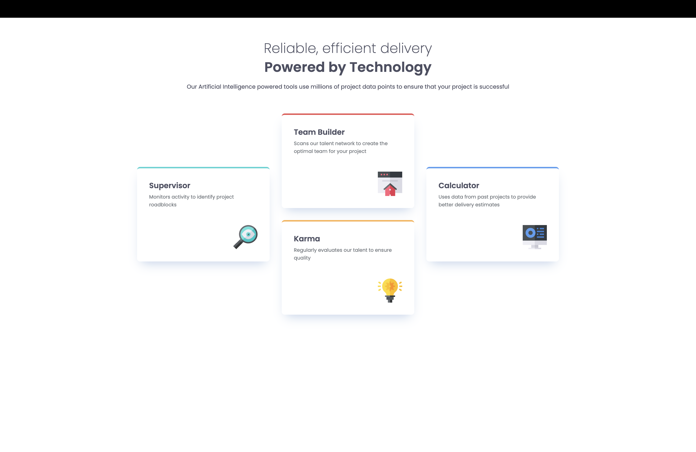

# Frontend Mentor - Four card feature section solution

This is a solution to the [Four card feature section challenge on Frontend Mentor](https://www.frontendmentor.io/challenges/four-card-feature-section-weK1eFYK). Frontend Mentor challenges help you improve your coding skills by building realistic projects.

## Table of contents

- [Overview](#overview)
  - [The challenge](#the-challenge)
  - [Screenshot](#screenshot)
  - [Links](#links)
- [My process](#my-process)
  - [Built with](#built-with)
  - [What I learned](#what-i-learned)
  - [Continued development](#continued-development)
  - [Useful resources](#useful-resources)
- [Author](#author)

## Overview

### The challenge

Users should be able to:

- View the optimal layout for the site depending on their device's screen size

### Screenshot

### Links

- Solution URL: [https://github.com/pattcaroline/frontend-mentor/blob/main/week6/four-card-feature-section-master/index.html]
- Live Site URL: [https://pattcaroline.github.io/frontend-mentor/week6/four-card-feature-section-master/index.html]

## My process

### Built with

- Semantic HTML5 markup
- CSS custom properties
- Flexbox
- CSS Grid
- Mobile-first workflow
- Sass/Scss

### What I learned

I learned to create mixins for spaces, typography and variables first and then speed up the process of designing and working faster in the layout.

### Continued development

I'll focus in organizing my scss files better. Use appropriate name for the files and classes.

### Useful resources

- [https://developer.mozilla.org/en-US/docs/Web/CSS/Guides/Grid_layout/Common_grid_layouts] - This helped me with GRID

## Author

- Frontend Mentor - [@pattcaroline](https://www.frontendmentor.io/profile/pattcaroline)
- Twitter - [@pattcaroline22](https://x.com/pattcaroline22)
