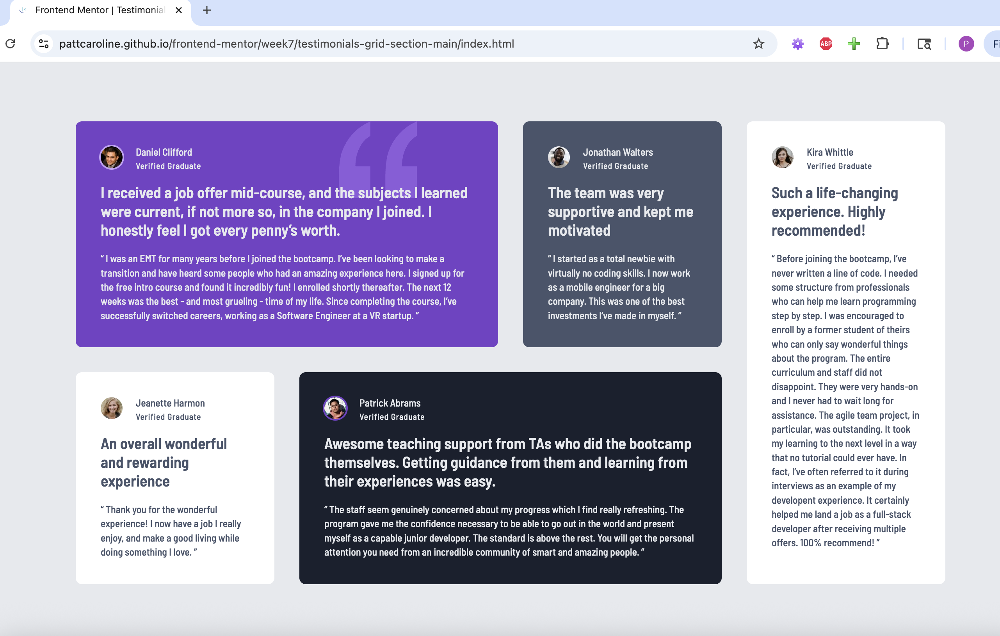

# Frontend Mentor - Testimonials grid section solution

This is a solution to the [Testimonials grid section challenge on Frontend Mentor](https://www.frontendmentor.io/challenges/testimonials-grid-section-Nnw6J7Un7). Frontend Mentor challenges help you improve your coding skills by building realistic projects.

## Table of contents

- [Overview](#overview)
  - [The challenge](#the-challenge)
  - [Screenshot](#screenshot)
  - [Links](#links)
- [My process](#my-process)
  - [Built with](#built-with)
  - [What I learned](#what-i-learned)
  - [Continued development](#continued-development)
- [Author](#author)

**Note: Delete this note and update the table of contents based on what sections you keep.**

## Overview

### The challenge

Users should be able to:

- View the optimal layout for the site depending on their device's screen size

### Screenshot

### Links

- Solution URL: [https://github.com/pattcaroline/frontend-mentor/blob/main/week7/testimonials-grid-section-main/index.html]
- Live Site URL: [https://pattcaroline.github.io/frontend-mentor/week7/testimonials-grid-section-main/index.html]

## My process

### Built with

- Semantic HTML5 markup
- CSS custom properties
- SCSS
- Flexbox
- CSS Grid
- Mobile-first workflow

### What I learned

I learned how to properly use grid-area. I implemented mobile-first workflow. I got better in interpreting figma designs to code pixel perfect layouts.

### Continued development

I'll focus on SCSS and grid and flexbox in future projects.

## Author

- Frontend Mentor - [@pattcaroline](https://www.frontendmentor.io/profile/pattcaroline)
- Twitter - [@pattcaroline22](https://x.com/pattcaroline22)
