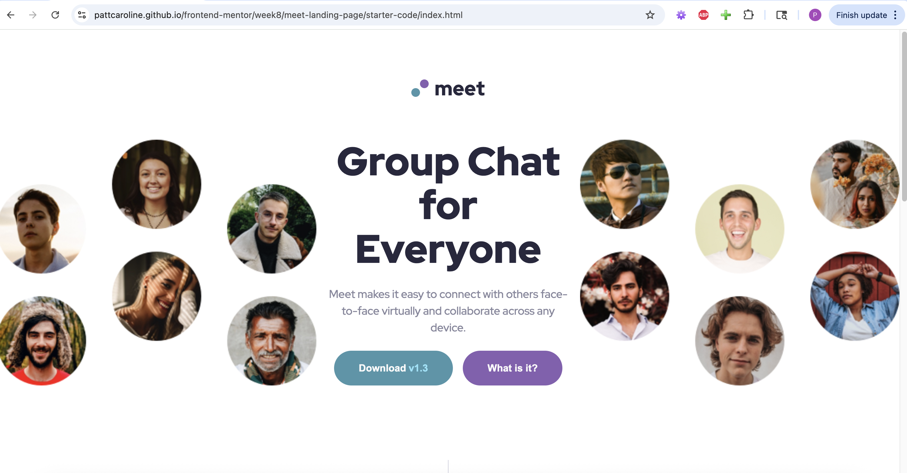

# Frontend Mentor - Meet landing page solution

This is a solution to the [Meet landing page challenge on Frontend Mentor](https://www.frontendmentor.io/challenges/meet-landing-page-rbTDS6OUR). Frontend Mentor challenges help you improve your coding skills by building realistic projects.

## Table of contents

- [Overview](#overview)
  - [The challenge](#the-challenge)
  - [Screenshot](#screenshot)
  - [Links](#links)
- [My process](#my-process)
  - [Built with](#built-with)
  - [What I learned](#what-i-learned)
  - [Continued development](#continued-development)
- [Author](#author)

## Overview

### The challenge

Users should be able to:

- View the optimal layout depending on their device's screen size
- See hover states for interactive elements

### Screenshot

### Links

- Solution URL: [https://github.com/pattcaroline/frontend-mentor/blob/main/week8/meet-landing-page/starter-code/index.html]
- Live Site URL: [https://pattcaroline.github.io/frontend-mentor/week8/meet-landing-page/starter-code/index.html]

## My process

### Built with

- Semantic HTML5 markup
- CSS custom properties
- Sass/SCSS
- Flexbox
- CSS Grid
- Mobile-first workflow

### What I learned

I learned to use @include in scss to add breakpoints and keep my style more efficient and clean. I'm getting better at organizing my styles in separate scss files.

### Continued development

I'll continue to focus on DRY and mobile-first workflow.

## Author

- Frontend Mentor - [@pattcaroline](https://www.frontendmentor.io/profile/pattcaroline)
- Twitter - [@pattcaroline22](https://x.com/pattcaroline22)
