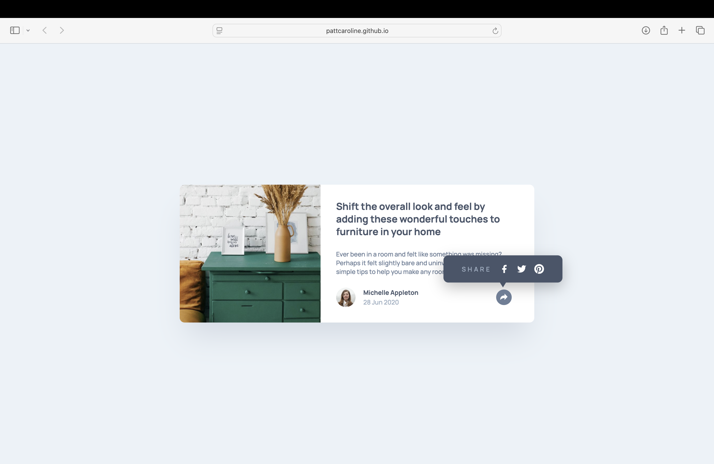

# Frontend Mentor - Article preview component solution

This is a solution to the [Article preview component challenge on Frontend Mentor](https://www.frontendmentor.io/challenges/article-preview-component-dYBN_pYFT). Frontend Mentor challenges help you improve your coding skills by building realistic projects.

## Table of contents

- [Overview](#overview)
  - [The challenge](#the-challenge)
  - [Screenshot](#screenshot)
  - [Links](#links)
- [My process](#my-process)
  - [Built with](#built-with)
  - [What I learned](#what-i-learned)
  - [Continued development](#continued-development)
  - [AI Collaboration](#ai-collaboration)
- [Author](#author)

## Overview

### The challenge

Users should be able to:

- View the optimal layout for the component depending on their device's screen size
- See the social media share links when they click the share icon

### Screenshot

### Links

- Solution URL: [Add solution URL here](https://github.com/pattcaroline/frontend-mentor/blob/main/week9/article-preview-component-master/index.html)
- Live Site URL: [Add live site URL here](https://pattcaroline.github.io/frontend-mentor/week9/article-preview-component-master/index.html)

## My process

### Built with

- Semantic HTML5 markup
- CSS custom properties
- Flexbox
- Desktop-firt workflow

### What I learned

I learned how to position a tooltip on top of a button using calc() and position:relative/ absolute.

### Continued development

I'm going to improve my usage of px to rem. I need to apply better the calc() in CSS. Also, I need to imrpove my Javascript logic. I'll improve my time effeciecy coding the projects and also the time I spend analizing the figma designs.

### AI Collaboration

Describe how you used AI tools (if any) during this project. This helps demonstrate your ability to work effectively with AI assistants.

- I have used Claude to help me debug the tooltip positioning on top of the share button

## Author

- Frontend Mentor - [@pattcaroline](https://www.frontendmentor.io/profile/pattcaroline)
- Twitter - [@pattcaroline22](https://x.com/pattcaroline22)
